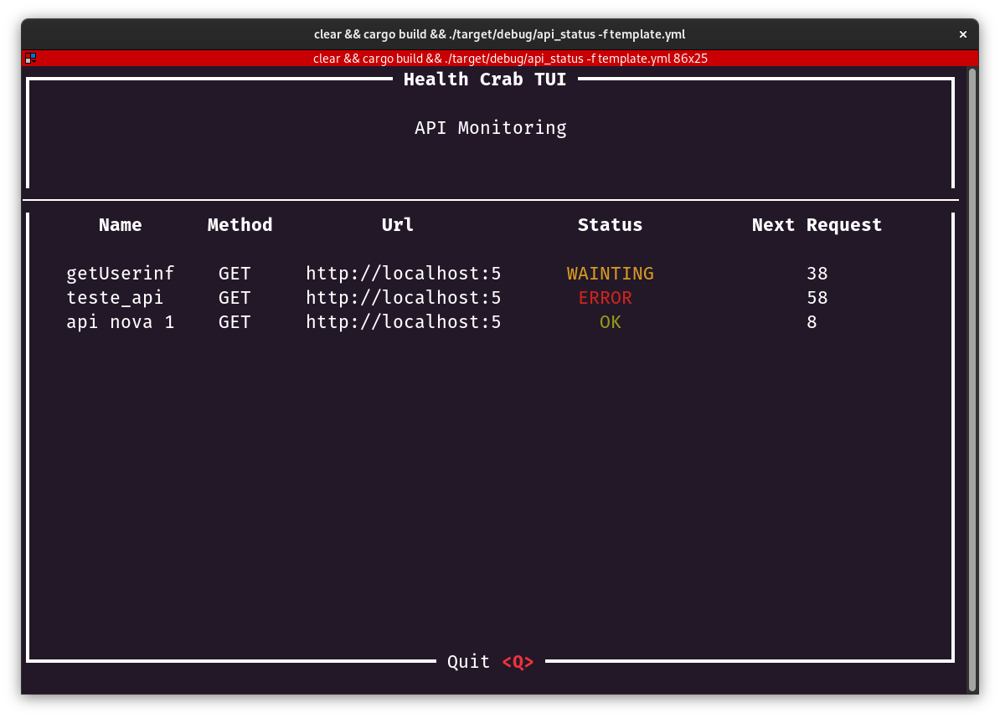

# Health 🦀 TUI

TUI application to monitoring API status by interval of time. 

_*This repository is used for my rust practice*_



## TODO

  - [ ] Fix end of threads when close application
  - [ ] Add more API information in UI
  - [ ] Option to add/remove api wihtout file
  - [ ] Update old deps

# Usage

Create a configuration file like this example:

Simple Request: 
```yml
requests:
  coffe_api:
    name: sample_api
    request:
      url: https://api.sampleapis.com/coffee/hot
      method: GET
    expected_status: 200
    interval: 10 #  interval of requests in seconds
```

If api depends of a previous request(ex: auth token) use `depends_on`:
```yml
requests:
  api1:
    name: POST_MESSAGE
    depends_on: 
      name: GET_TOKEN
      header_fields:
        - auth.token
      body_fields: # mapped json fields
        - field1.field2
        - test1.test2
      request:
        url: http://127.0.0.1:5000/auth/token
        method: GET
        headers:
          test: 123
          test2: 1234
    request:
      url: http://127.0.0.1:5000/message/555555555
      method: POST
      headers:
        authorization: "Bearer {{auth.token}}" # using mapped key in depends_on response
        content-type: "application/json"
      body:
        test: "test {{test1.test2}} test" # using mapped key in depends_on response
        test2: "{{field1.field2}}" # using mapped key in depends_on response
    expected_status: 201
    interval: 10 # interval of requests in seconds
```

## Usage

```
git clone https://github.com/EltonARodrigues/check_api_status.git
cd check_api_status
cargo build
# execute aplication using path of configuration file
./target/debug/api_status -f template.yml
```

